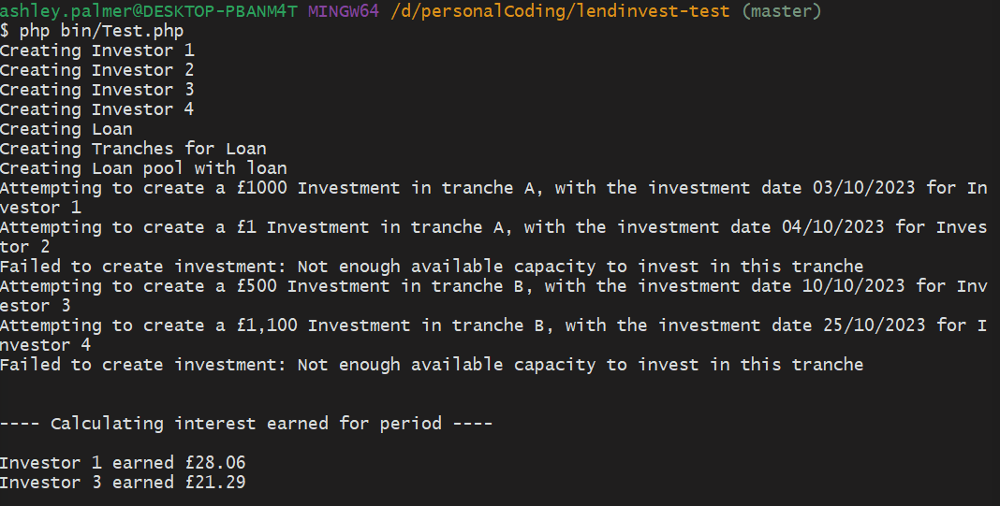

# LendInvest Coding Test

## Getting Started

### Requirements

After cloning this repository, please install the required dependencies via Composer:

```
> composer install
```

I am using PHP 8.3.8 so please make sure that you are using at least PHP 8.1, otherwise I can't guarantee it wont be bug free!

## Running tests

I have created a single Test.php executable file in the `bin/` dir that should run through and show proof that it covers all requested test cases.

```
> php bin/Test.php
```

### Example output



To run the Unit tests, I have created a composer script so that can be done via `> composer test`,
or manually with `> vendor/bin/phpunit tests`.
